  

# 🚆 Rail-Speed-Coverage-By-Country

  
  
  
  
  
  
  

## 🌐 Global Rail Network Speed Share Comparison

A comparative breakdown of the rail network distribution across **India 🇮🇳**, **Europe 🇪🇺**, and **China 🇨🇳**, categorized by operational speeds and train tiers. 🚄💨

---

## 📊 Rail Network Distribution Share

The table below shows the percentage share based on total operating rail network sizes:

<!-- DATA_TABLES_START -->

### 📅 2024 Rail Network Distribution

| Country/Region | 🚂 Slow Trains  *(Local/Commuter/Conventional)* | 🚆 RRTS / Regional Express  *(Medium-Speed: 140–200 km/h)* | 🚄 Bullet Trains / High-Speed Rail  *(Dedicated: 250–350+ km/h)* |
| :--- | :---: | :---: | :---: |
| India 🇮🇳 | **99.93%**  *(~68,000+ km conventional track)* | **0.07%**  *(~82 km operational Delhi-Meerut RRTS)* | **0.00%**  *(0 km operational; Mumbai-Ahmedabad under construction)* |
| Europe (EU) 🇪🇺 | **88.00%**  *(~180,000 km standard local & freight lines)* | **5.00%**  *(~10,000 km Regional Express/InterCity lines)* | **7.00%**  *(~15,000+ km dedicated TGV/AVE lines)* |
| China 🇨🇳 | **69.00%**  *(~110,000 km conventional freight & sleeper lines)* | **4.00%**  *(~6,000+ km "D-class" regional/intercity lines)* | **27.00%**  *(~48,000+ km dedicated "G-class" tracks)* |

<!-- DATA_TABLES_END -->

---

## 💡 Key Insights

* 🇮🇳 **India's Legacy Reliance:** The passenger rail system depends almost exclusively on the conventional network. The Namobharat (RRTS) is a brand-new asset class that is steadily scaling up as more National Capital Region corridors open.
* 🇪🇺 **Europe's Balanced Middle-Ground:** Europe does not run entirely on bullet trains; the vast majority of its infrastructure remains traditional commuter rail. However, its "middle tier" (Regional-Express) is deeply mature and acts as a widespread regional network.
* 🇨🇳 **China's High-Speed Domination:** China is a structural anomaly, with bullet trains making up more than a quarter of its total geographic rail infrastructure. In practice, high-speed rail accounts for over 65% of daily passenger journeys there.

---

## 💖 Support & Contributions

Thank you for checking out this dataset and comparison! 🌟

If you find this project informative or helpful:
- ⭐ **Star** this repository to show your appreciation!
- 🔀 **Fork** it to add more regional data or analysis.
- 📢 **Share** it with fellow infrastructure and transit enthusiasts!
- ☕ **Sponsor / Buy a Coffee:** You can support further development via our [GitHub Sponsor Dashboard](https://github.com/sponsors/ishandutta2007).

---

## 📈 Star History

